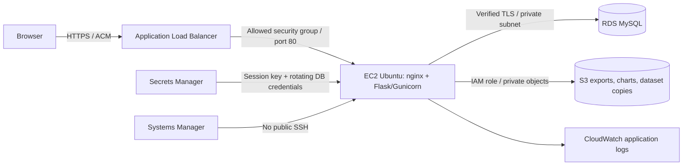

# Cloudfolio — Cloud Stock Analytics

[](https://github.com/Vidhan615/cloud-stock-analytics/actions/workflows/ci.yml)

A Flask portfolio dashboard with database-backed accounts, stock analytics, private exports, and an AWS infrastructure template. Built by **Vidhan Doshi** as a reproducible implementation of the cloud stock analytics project described in his internship report.

**[Explore the read-only dashboard](https://vidhan615.github.io/cloud-stock-analytics/)** · [AWS deployment guide](docs/deployment.md) · [API and security notes](docs/api.md)

The public preview runs on GitHub Pages. Accounts and personal saves require the Flask application. This repository includes deployment code; it does **not** claim an active AWS deployment or verify a previous internship deployment.

## What you can do

- Explore six Indian stock symbols and 90 sample sessions, with stock search and responsive charts.
- Compare SMA 20, EMA 20 and Wilder RSI 14 with short explanations of each calculation.
- Register, sign in and save your own holdings to a database. Edit checks prevent an older browser session from silently overwriting a newer change.
- Track invested capital, current value, unrealised P/L and allocation. Separate accounts have separate holdings, watchlists, activity and exports.
- Download portfolio CSVs and server-rendered chart SVGs. AWS mode stores them privately in S3 and checks account ownership before downloads.
- Switch between white and black themes; the theme preference stays in your browser.
- Run locally with SQLite, use Docker Compose with MySQL, or review the CloudFormation stack for AWS.

## Run locally

Python 3.11 or 3.12 is required. From the repository folder:

```powershell
# Windows PowerShell
py -3.11 -m venv .venv
.\.venv\Scripts\python.exe -m pip install -r requirements.lock
.\.venv\Scripts\python.exe -m flask --app wsgi init-db
.\.venv\Scripts\python.exe -m flask --app wsgi run --port 5000
```

```bash
# Linux / macOS
python3 -m venv .venv
.venv/bin/python -m pip install -r requirements.lock
.venv/bin/python -m flask --app wsgi init-db
.venv/bin/python -m flask --app wsgi run --port 5000
```

Open `http://127.0.0.1:5000`. Create an account with an example email and a password of at least 12 characters; no email service is connected. The local database, signing key and exports live in the ignored `instance/` folder. Restarting the app preserves them. The Flask development server is for local use.

`.env.example` documents configuration. Flask is not configured to load it automatically: export variables in your shell, use an environment manager, or use Compose (which reads `.env`). Local defaults work without an `.env` file. Production requires a strong signing key and secure cookies.

## MySQL with Docker

```bash
cp .env.example .env
# Set DB_PASSWORD, DB_ROOT_PASSWORD and SECRET_KEY in .env before starting.
# Generate each using: python -c "import secrets; print(secrets.token_hex(32))"
docker compose up --build -d --wait
```

Open `http://127.0.0.1:8000`. Use URL-safe passwords, such as the generated hex strings, because the connection URL interpolates them. Compose binds the app only to localhost and does not publish the MySQL port. Named volumes preserve the database and local exports. `docker compose down` preserves those volumes; adding `-v` deletes this local test data. Compose uses HTTP development settings; the AWS stack provides the production HTTPS boundary.

## Cloud architecture



The stack uses an encrypted EC2 disk, an encrypted private RDS database, versioned private S3, an ACM certificate, scoped instance permissions, dependency readiness checks and a weekly dataset-copy timer. It creates billable resources. It is a **single-application-instance, single-AZ database prototype**, not a highly available production platform. The public ALB spans two availability zones; that alone does not make the app highly available.

See [the deployment guide](docs/deployment.md) for prerequisites, commands, verification and cleanup. AWS deployment is deliberately separate from GitHub publishing.

## Data and calculations

`data/sample_prices.csv` contains **generated fictional OHLCV data**, not exchange data, live prices or the missing original report dataset. `scripts/generate_sample.py` uses fixed seeds and aligned weekdays to generate 540 rows. The six symbols are RELIANCE, TCS, INFY, HDFCBANK, SBIN and ITC; company names only identify the example universe.

The final RELIANCE/TCS/INFY closes are anchored to the report's illustrative portfolio inputs. Its example of 10 shares at ₹2,720, 5 at ₹3,800 and 15 at ₹1,520 produces ₹69,000 invested, ₹71,875 marked value, ₹2,875 unrealised P/L and 4.17% return. Automated tests check this arithmetic. Earlier prices and indicator results are new synthetic examples; the repository does not claim to reproduce the report's indicator numbers.

SMA starts after 20 closes. EMA is initialized with the first observed close. RSI uses Wilder smoothing after 14 changes; a flat series returns 50. The optional API `end=YYYY-MM-DD` calculates only from the observed prefix. Holdings use Decimal arithmetic and rounded monetary output. This is a holdings monitor: it does not execute trades or model fees, realised P/L, dividends, splits or live fundamentals.

## Check the project

```bash
python -m pip install -r requirements.lock -r requirements-dev.txt
python -m pytest
ruff check .
ruff format --check .
cfn-lint infra/cloudformation.yaml
pip-audit -r requirements.lock
python scripts/build_preview.py
python scripts/package_release.py
```

Use the virtual environment's Python and tool paths on Windows. CI runs the suite with SQLite on Python 3.11/3.12 and an isolated MySQL 8.4 service, validates the infrastructure, audits pinned runtime dependencies, builds the container and verifies the Compose app's readiness. Successful main-branch checks trigger the read-only Pages preview. The release ZIP uses an allowlist and prints its SHA256 for deployment; local databases, secrets and private reference PDFs are excluded.

`requirements.lock` pins runtime packages without package hashes. Review updates, regenerate the pins and rerun checks before deployment. Development-tool ranges are in `requirements-dev.txt`.

## Project layout

| Folder | Purpose |
|---|---|
| `cloudfolio/` | Flask factory, account APIs, data models, analytics, private storage and browser UI |
| `data/` | Reproducible synthetic dataset |
| `infra/` | CloudFormation infrastructure and EC2 bootstrap |
| `scripts/` | Dataset generation, static preview and release packaging |
| `tests/` | Arithmetic, account boundaries, persistence, indicator causality and AWS client contracts |
| `docs/` | API, operating limits and deployment runbook |

MIT licensed. This is an educational portfolio project; its sample indicators do not predict investment returns.
